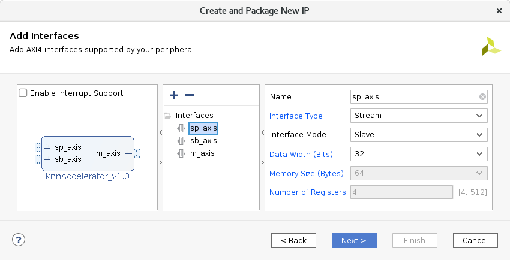
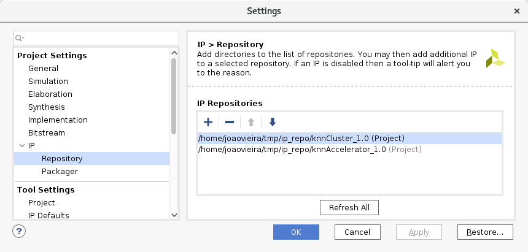

# KNNStuff
K-Nearest Neighbors STreaming Unit for FPGA (KNNStuff) is a scalable RTL implementation of the KNN classifier. Since the design is highly reconfigurable, KNNStuff can be implemented in FPGAs of all sizes. This repository contains all the necessary files to rebuilt a project with KNNStuff. For testing purposes, please refer to the [KNNSim repository](https://github.com/joaomiguelvieira/KNNSim), which includes a tuned version of the KNN classifier suited to achieve maximum performance in general purpose processors.

1. [Content of this repository](#content-of-this-repository)
2. [Pre-requisites](#pre-requisites)
3. [Create a new project](#create-a-new-project)
4. [Package the IPs](#package-the-ips)
5. [Build the block diagram](#build-the-block-diagram)
6. [Create an application project](#create-an-application-project)
7. [Run KNNStuff](#run-knn-stuff)
8. [Customizing KNNStuff parameters](#customizing-knnstuff-parameters)

## Content of this repository
* `/rtl`: contains the VHDL files and the Xilinx IP files to generate the custom IP cores;
* `/scripts`: contains auxiliary scripts to help to build the project;
* `/src`: contains the source code of the KNN classifier.

## Pre-requisites
To use KNNStuff, the minimum requisits are demanded:
* A host computer running Linux;
* Xilinx Vivado 2018.3 or newer:
  * Follow [this](https://www.xilinx.com/support/download/index.html/content/xilinx/en/downloadNav/vivado-design-tools/2018-3.html) link to download;
  * Download and install the board files (find instructions [here](https://reference.digilentinc.com/reference/software/vivado/board-files));
  * Do not forget to install the cable drivers (execute the script located at `<vivado_install_dir>/data/xicom/cable_drivers/lin64/install_script/install_drivers/install_drivers`).
* A Xilinx SoC **(this tutorial uses the Diligent Zybo board, but all procedures are also valid for the ZedBoard)**;
* A micro USB cable to connect the board to the host computer.

## Create a new project
First, you need to create a new project that will contain the synthesizable block design to program the SoC. To do that, open Vivado and create a new project by selecting *Create Project* from the *Quick Start* menu.


Select a project name and location.


Select *RTL Project*.


Make sure that the *Target language* is VLDH.


Press *Next* twice without adding any constraints. From the menu *Boards*, select *Zybo*.


Finally, press *Next* and *Finish* to open the newly created project.

## Package the IPs
After creating a new project, the custom IPs need to be packaged and build from the VHDL sources. To do that, select *Tools* and then *Create and Package New IP*. Press *Next* and select *Create a new AXI4 peripheral*. Name the first IP "knnAccelerator" and press *Next*. Then, it will be necessary to create three AXI4 Stream interfaces (two slaves and one master). In the end, the list of interfaces should look like the following:



**Note that you should create the interfaces with precisely these names and parameters. The master interface should have *Master* as *Interface Mode* instead of *Slave*.**

Select *Next*, *Edit IP*, and *Finish*.

To add the sources of the first IP, right-click on *Design Sources* and select *Add Sources*, *Add or create design sources*, and *Add Files*. Navigate to `rtl/knnaccelerator`, select all the files and press *Finish*. Select the files named *knnAccelerator_v1_0_m_axis*, *knnAccelerator_v1_0_sb_axis*, and *knnAccelerator_v1_0_sp_axis*, right-click and *Remove file from project*.

In the *Sources* menu, find the *Libraries* tab. Select the file *knnCluster_Pkg.vhd*, under *Design Sources*, *VHDL*, *xil_defaultlib*. Right-click and select *Set Library*. Write *knnCluster* and hit *Ok*.

From the flow navigator menu, select *Package IP*. Go through the several tabs that have the review icon (a small sheet of paper with a pencil) and merge all the changes (click on the suggestions presented in the yellow bar). Finally, select *Review and Package* and *Re-Package IP*. **Note that if you want to keep the project after packaging the IP, you need to select first *Edit packaging settings* and deselect the option *Delete project after packaging***.

Next, you need to repeat the same procedure to the other IP.

Reopen the project that you created in section [Create a new project](#create-a-new-project), select *Tools* and then *Create and Package New IP*. Press *Next* and select *Create a new AXI4 peripheral*. Name the other IP "knnCluster" and press *Next*. Then, it will be necessary to create three AXI4 Stream interfaces (two slaves and one master). In the end, the list of interfaces should look like the following:


**Note that you should create the interfaces with precisely these names and parameters. The master interface should have *Master* as *Interface Mode* instead of *Slave*.**

Select *Next*, *Edit IP*, and *Finish*.

To add the sources of the first IP, right-click on *Design Sources* and select *Add Sources*, *Add or create design sources*, and *Add Files*. Navigate to `rtl/knncluster`, select all the files and press *Finish*. Select the files named *knnCluster_v1_0_m_axis*, *knnCluster_v1_0_sb_axis*, and *knnCluster_v1_0_sp_axis*, right-click and *Remove file from project*.

In the *Sources* menu, find the *Libraries* tab. Select the file *knnCluster_Pkg.vhd*, under *Design Sources*, *VHDL*, *xil_defaultlib*. Right-click and select *Set Library*. Write *knnCluster* and hit *Ok*.

From the flow navigator menu, select *Package IP*. Go through the several tabs that have the review icon (a small sheet of paper with a pencil) and merge all the changes (click on the suggestions presented in the yellow bar). Finally, select *Review and Package* and *Re-Package IP*. **Note that if you want to keep the project after packaging the IP, you need to select first *Edit packaging settings* and deselect the option *Delete project after packaging***.

## Build the block diagram
After packaging both IPs, you can close all Vivado projects but the first one you created. In the *Flow Navigator* menu, under *PROJECT MANAGER*, hit *Settings* and navigate to *IP* and then *Repository*. Add the directory that contains the IPs to the list of repositories, and make sure that both IPs are detected.



Under *IP INTEGRATOR*, hit *Create Block Design*. You can name it whatever you want. Then, run the script 
 to generate the block diagram of the system. You can do so by either selecting *Tools* and *Run Tcl Script* or by simply copying and pasting the content of the script in the *Tcl Console*. If you completed all the previous steps correctly, there should no errors, and the output should look like the following.

```
# create_bd_cell -type ip -vlnv xilinx.com:ip:processing_system7:5.5 processing_system7_0
# apply_bd_automation -rule xilinx.com:bd_rule:processing_system7 -config {make_external "FIXED_IO, DDR" apply_board_preset "1" Master "Disable" Slave "Disable" }  [get_bd_cells processing_system7_0]
# set_property -dict [list CONFIG.PCW_USE_S_AXI_HP0 {1} CONFIG.PCW_S_AXI_HP0_DATA_WIDTH {32} CONFIG.PCW_QSPI_PERIPHERAL_ENABLE {0} CONFIG.PCW_QSPI_GRP_SINGLE_SS_ENABLE {1} CONFIG.PCW_ENET0_PERIPHERAL_ENABLE {0} CONFIG.PCW_SD0_PERIPHERAL_ENABLE {0} CONFIG.PCW_TTC0_PERIPHERAL_ENABLE {0} CONFIG.PCW_USB0_PERIPHERAL_ENABLE {0} CONFIG.PCW_GPIO_MIO_GPIO_ENABLE {0}] [get_bd_cells processing_system7_0]
CRITICAL WARNING: [PSU-1]  Parameter : PCW_UIPARAM_DDR_DQS_TO_CLK_DELAY_0 has negative value -0.073 . PS DDR interfaces might fail when entering negative DQS skew values. 
CRITICAL WARNING: [PSU-2]  Parameter : PCW_UIPARAM_DDR_DQS_TO_CLK_DELAY_1 has negative value -0.034 . PS DDR interfaces might fail when entering negative DQS skew values. 
CRITICAL WARNING: [PSU-3]  Parameter : PCW_UIPARAM_DDR_DQS_TO_CLK_DELAY_2 has negative value -0.03 . PS DDR interfaces might fail when entering negative DQS skew values. 
CRITICAL WARNING: [PSU-4]  Parameter : PCW_UIPARAM_DDR_DQS_TO_CLK_DELAY_3 has negative value -0.082 . PS DDR interfaces might fail when entering negative DQS skew values. 
# create_bd_cell -type ip -vlnv xilinx.com:ip:axi_dma:7.1 axi_dma_0
# set_property -dict [list CONFIG.c_include_sg {0} CONFIG.c_sg_length_width {26} CONFIG.c_sg_include_stscntrl_strm {0}] [get_bd_cells axi_dma_0]
# apply_bd_automation -rule xilinx.com:bd_rule:axi4 -config { Clk_master {Auto} Clk_slave {Auto} Clk_xbar {Auto} Master {/axi_dma_0/M_AXI_MM2S} Slave {/processing_system7_0/S_AXI_HP0} intc_ip {New AXI Interconnect} master_apm {0}}  [get_bd_intf_pins processing_system7_0/S_AXI_HP0]
INFO: [Ipptcl 7-1463] No Compatible Board Interface found. Board Tab not created in customize GUI
</processing_system7_0/S_AXI_HP0/HP0_DDR_LOWOCM> is being mapped into </axi_dma_0/Data_MM2S> at <0x00000000 [ 512M ]>
# apply_bd_automation -rule xilinx.com:bd_rule:axi4 -config { Clk_master {Auto} Clk_slave {Auto} Clk_xbar {Auto} Master {/processing_system7_0/M_AXI_GP0} Slave {/axi_dma_0/S_AXI_LITE} intc_ip {New AXI Interconnect} master_apm {0}}  [get_bd_intf_pins axi_dma_0/S_AXI_LITE]
</axi_dma_0/S_AXI_LITE/Reg> is being mapped into </processing_system7_0/Data> at <0x40400000 [ 64K ]>
# apply_bd_automation -rule xilinx.com:bd_rule:axi4 -config { Clk_master {Auto} Clk_slave {/processing_system7_0/FCLK_CLK0 (100 MHz)} Clk_xbar {/processing_system7_0/FCLK_CLK0 (100 MHz)} Master {/axi_dma_0/M_AXI_S2MM} Slave {/processing_system7_0/S_AXI_HP0} intc_ip {/axi_mem_intercon} master_apm {0}}  [get_bd_intf_pins axi_dma_0/M_AXI_S2MM]
</processing_system7_0/S_AXI_HP0/HP0_DDR_LOWOCM> is being mapped into </axi_dma_0/Data_S2MM> at <0x00000000 [ 512M ]>
# create_bd_cell -type ip -vlnv xilinx.com:ip:axis_broadcaster:1.1 axis_broadcaster_0
# create_bd_cell -type ip -vlnv user.org:user:knnCluster:1.0 knnCluster_0
# connect_bd_intf_net [get_bd_intf_pins axis_broadcaster_0/M00_AXIS] [get_bd_intf_pins knnCluster_0/sp_axis]
# connect_bd_intf_net [get_bd_intf_pins axis_broadcaster_0/M01_AXIS] [get_bd_intf_pins knnCluster_0/sb_axis]
# connect_bd_intf_net [get_bd_intf_pins knnCluster_0/m_axis] [get_bd_intf_pins axi_dma_0/S_AXIS_S2MM]
# connect_bd_intf_net [get_bd_intf_pins axis_broadcaster_0/S_AXIS] [get_bd_intf_pins axi_dma_0/M_AXIS_MM2S]
# apply_bd_automation -rule xilinx.com:bd_rule:clkrst -config {Clk "/processing_system7_0/FCLK_CLK0 (100 MHz)" }  [get_bd_pins axis_broadcaster_0/aclk]
# apply_bd_automation -rule xilinx.com:bd_rule:clkrst -config {Clk "/processing_system7_0/FCLK_CLK0 (100 MHz)" }  [get_bd_pins knnCluster_0/m_axis_aclk]
# regenerate_bd_layout
# validate_bd_design
CRITICAL WARNING: [PSU-1]  Parameter : PCW_UIPARAM_DDR_DQS_TO_CLK_DELAY_0 has negative value -0.073 . PS DDR interfaces might fail when entering negative DQS skew values. 
CRITICAL WARNING: [PSU-2]  Parameter : PCW_UIPARAM_DDR_DQS_TO_CLK_DELAY_1 has negative value -0.034 . PS DDR interfaces might fail when entering negative DQS skew values. 
CRITICAL WARNING: [PSU-3]  Parameter : PCW_UIPARAM_DDR_DQS_TO_CLK_DELAY_2 has negative value -0.03 . PS DDR interfaces might fail when entering negative DQS skew values. 
CRITICAL WARNING: [PSU-4]  Parameter : PCW_UIPARAM_DDR_DQS_TO_CLK_DELAY_3 has negative value -0.082 . PS DDR interfaces might fail when entering negative DQS skew values. 
CRITICAL WARNING: [PSU-1]  Parameter : PCW_UIPARAM_DDR_DQS_TO_CLK_DELAY_0 has negative value -0.073 . PS DDR interfaces might fail when entering negative DQS skew values. 
CRITICAL WARNING: [PSU-2]  Parameter : PCW_UIPARAM_DDR_DQS_TO_CLK_DELAY_1 has negative value -0.034 . PS DDR interfaces might fail when entering negative DQS skew values. 
CRITICAL WARNING: [PSU-3]  Parameter : PCW_UIPARAM_DDR_DQS_TO_CLK_DELAY_2 has negative value -0.03 . PS DDR interfaces might fail when entering negative DQS skew values. 
CRITICAL WARNING: [PSU-4]  Parameter : PCW_UIPARAM_DDR_DQS_TO_CLK_DELAY_3 has negative value -0.082 . PS DDR interfaces might fail when entering negative DQS skew values. 
# save_bd_design
Wrote  : </home/joaovieira/tmp/project_1/project_1.srcs/sources_1/bd/design_1/design_1.bd>
```

From the menu *Sources*, right-click on your design and select *Create HDL Wrapper*. Then select *Let Vivado manage wrapper and auto-update* and hit *Ok*.

Finally, in the *Flow Navigator* menu, under *PROGRAM AND DEBUG*, hit *Generate Bitstream*. You will be prompted to launch Synthesis and Implementation first. Accept the suggestion, select the number of jobs to run (choose the highest number from the dropdown list), and press *Ok* to generate the bitstream. When Vivado finishes generating the bitstream, you can close the dialog window.

## Create an application project
Before creating an SDK project, from the Vivado menu hit *File*, *Export* and *Export Hardware*. Make sure that you include the bitstream and hit *Ok*. Vivado has a known bug in exporting designs. Thus **you need to export it twice**.

After exporting the design **twice**, hit *File* and *Launch SDK*.

## Run KNNStuff
After launching Vivado SDK, hit *File*, *New* and *Application Project*. Name the project "KNN" and hit *Next*. Choose *Empty Application* and hit *Finish*. Expand the newly created project *KNN* in the *Project Explorer* menu, right-click on *src* and hit *Import*. Pick *General*, *File System* and *Next*. Navigate to the directory where you cloned this GitHub repo, select `src` and hit *Ok*. Select all the files contained in that folder and hit *Finish*.

Right-click on *KNN* under the *Project Explorer* menu and select *Generate Linker Script*. Change the place to put the *Code Sections*, the *Data Sections* and the *Heap and Stack* to `ps7_ram_0`. Set the *Heap Size* and the *Stack Size* to be equal to 10 KB. Press *Generate* to generate the new linker script.

At this point, connect the *UART/PROG* connector of Zybo board to your computer using a micro USB cable and turn on the board. In a terminal, use the command `dmesg` to determine where the device was mapped. In my case, it was mapped to `/dev/ttyUSB1`. Use an application like `screen` or minicom to open a connection with the board to see the output. If you are using `minicom`, that can be achieved with the command `sudo minicom -D /dev/ttyUSB1`. **Do not forget to replace `/dev/ttyUSB1` by the actual board's identifier.**

From *Xilinx* select *Program FPGA* and hit *Program*. You will see a progress bar showing that the device is being programmed.

On [line 199 of `src/KNN.c`](src/KNN.c#L199), right after entering the `main`, add `return 0`. Then, right-click on *KNN*, in the *Project Explorer* menu, *Run As* and *Launch On Hardware (System Debugger)*. After this, remove the line that you just added to the code, restoring the main to its original code.

Under *Run*, *Run Configurations*, there should be now a profile called *System Debugger using Debug_KNN.elf on Local*. Select that profile and navigate to *Application*, *Advanced Options: Edit* and add a data file to be downloaded to the board before running the software. That file can be downloaded from another GitHub repository called [KNNSim](https://github.com/joaomiguelvieira/KNNSim/blob/master/datasets/bin/0_iris.bin). Set the address of that file to be `0x100000`. Hit *Apply*, and then hit *Run*.

You will see an output similar to the following.

```
============== SUMMARY ==============
        N Nearest | 5
        N Classes | 3
    N Coordinates | 4
   N Test Samples | 50
N Control Samples | 100
-------------------------------------                                     
   N Accelerators | 4                                                     
            N DMA | 1                                                     
    Cores per DMA | 4                                                     
-------------------------------------                                     
    Software Time | 3170.56 us
  Software Cycles | 2060866
-------------------------------------
    Hardware Time | 307.17 us
  Hardware Cycles | 199658
-------------------------------------
          Speedup | 10.33
=====================================
```

Congratulations! You just got started with KNNStuff.

## Customizing KNNStuff parameters
